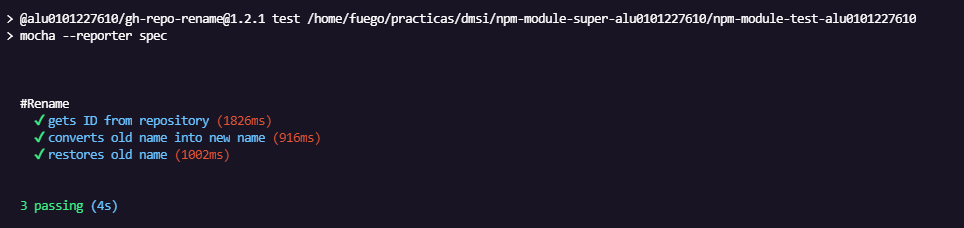
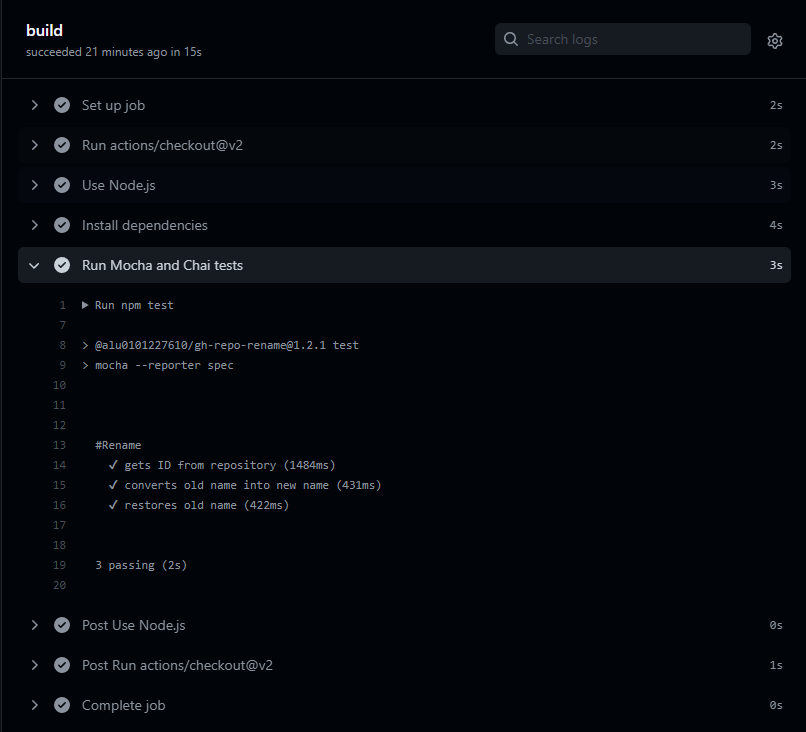

# Repo Rename
## Github Command Line
### Antonella García Alvarez
### alu0101227610

### Uso de la aplicacion

Nuevamente, adjunto las opciones disponibles en nuestra extension que se ejecuta cuando la llamamos, o cuando ejecutamos la extension sin haber puesto los argumentos necesarios.

```bash
Usage: gh-repo-rename [options]

Options:
  -V, --version             output the version number
  -o, --owner <owneranization>  specifies the owneranization
  -r, --repo <reponame>     specifies the repository
  -n, --name <name>         name
  -h, --help                display help for command

```

### Test with Mocha and Chai

Para publicar nuestro modulo, sería crucial crear pruebas para él. Para ello utilizaremos las herramientas de chai y mocha, el primer paso es instalarlas como dependencias de desarrollo o _devDependencies_ en nuestro `.json`.

```js
  "devDependencies": {
    "chai": "^4.3.4",
    "mocha": "^9.1.3",
    "documentation": "*"
  }
```

Tambien podriamos utilizar las siguientes sentencias:

```bash
npm install mocha --save-dev
npm install chai --save-dev
```

Una vez hecho esto, para instalarla hacemos un `npm install` y finalizamos con un `mocha init test`.

Además, deberiamos añadir su instalacion como script en el `.json`para asegurarnos de que se pueda ejecutar de forma automatica los test con tan solo poner un alias.

```js
  "scripts": {
    "test": "mocha --reporter spec",
  }
```

Siguiendo los pasos para el desarrollo de los test, creamos un directorio llamado test para guardar un index, en mi caso repo-rename.js, en el cual haremos los test unitarios. En los cuales tendremos bloques descriptivos usando _describe_ donde incluiremos cada funcion respectiva a su entorno. Para mi ha quedado algo así:

```js
describe('#Rename', function() {
it('gets ID from repository', function() {
renameRepo.getRepoID("ULL-ESIT-DMSI-1920", "prueba-antonella-funciona").should.equal('R_kgDOGbeYPw\n');
});
it('converts old name into new name', function() {
  renameRepo.renameRepo("R_kgDOGbeYPw", "prueba-antonella-funciona1").should.equal("prueba-antonella-funciona1");
  });
});
```

Como se ve, son test claros y faciles de crear, y la ejecución es tan sencilla como poner npm test ya que creamos el alias para la ejecución. En la terminal se ve algo como esto:



### Github Actions

A continuacion para continuar con el testeo en profundidad de nuestra aplicacion utilizaremos una herramienta que nos facilita Github, llamada Actions. Esta nos permite utilizar un workflow para ejecutar eventos de forma automatica segun un evento, por ejemplo un push.

Para ponerlo en marcha necesitaremos un fichero .yml, como tenemos en nuestro submodulo `npm-module-test`, y en el definiremos la serie de pasos meticulosos para la ejecucion de pruebas. Ademas tenemos que tener en cuenta el uso de los secretos, otra herramienta para darle permiso a Actions para que actue sobre repositorios ya que por ejemplo en nuestro caso, necesitamos cambiar el nombre de un repo y para ello necesitariamos un Token personal para tener permisos necesarios. Sino, estas pruebas no funcionaran.



Como vemos en la imagen anterior, asi se veria cuando los test han funcionado correctamente en las Actions.

### Documentación

Para la documentación de nuestro proyecto utilizaremos JsDoc que es una herramienta que genera automaticamente documentación siguiendo el estandar en formato web a partir de los comentarios formateados correctamente en los ficheros necesarios y de nuestro README.

Para instalarla, debemos hacerlo globalmente y luego incluirla en las dependencias de desarrollo de nuestro proyecto.

El correcto formato de nuestros comentarios debe seguir el estandar, que sería así:

```js
/**
 * gets repo ID
 * @param {string} owner 
 * @param {string} name 
 * @returns ID
 */
```

Al tener ya los comentarios deseados ejecutamos `jsdoc fichero.js` y nos creará un directorio llamado `out`donde existiran los recursos de frontend (CSS, HTML y JavaScript) necesarios para visualizar la página de documentación